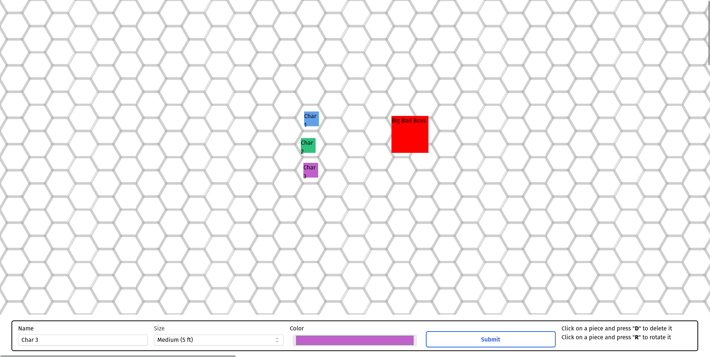

# Online Tabletop Simulator

  
  
  
  
  
  

## Preview

## Description

This was a simple project that I made to experiment with websockets, whoever it also can be used to play online with friends using a simple online tabletop, create pieces and drag them in the board
